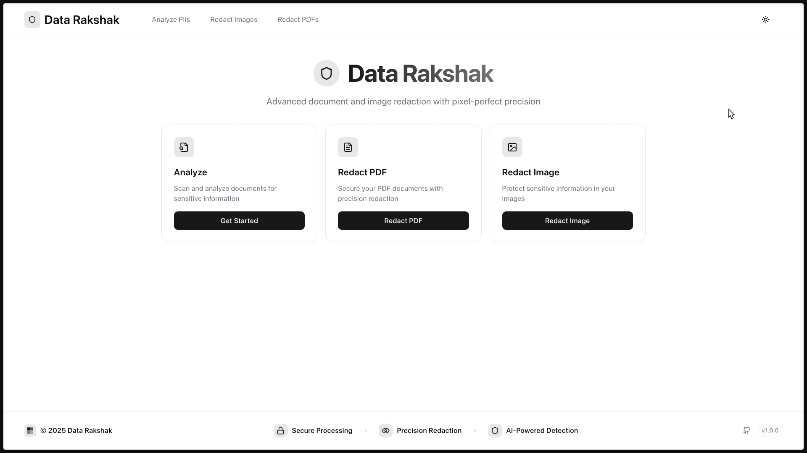
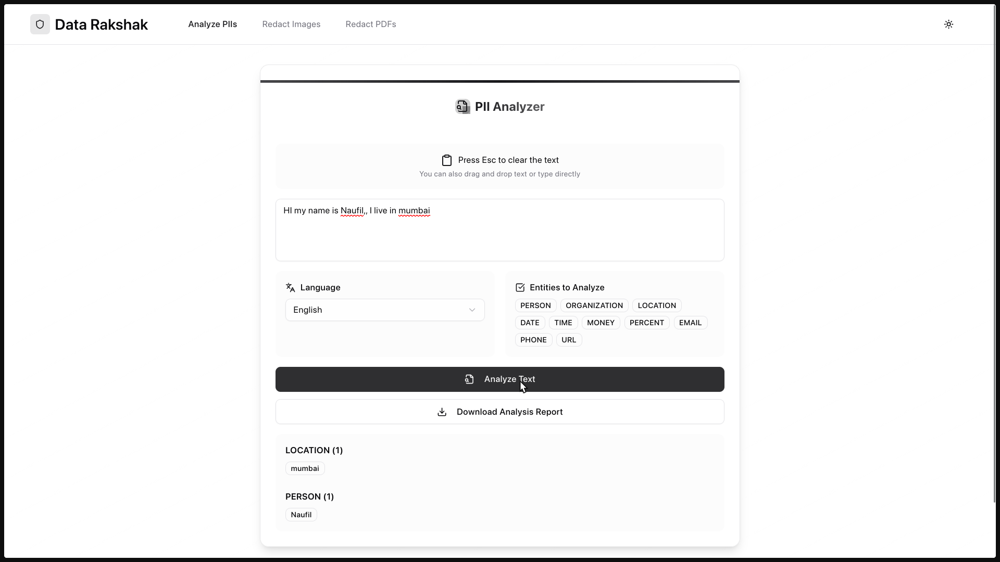
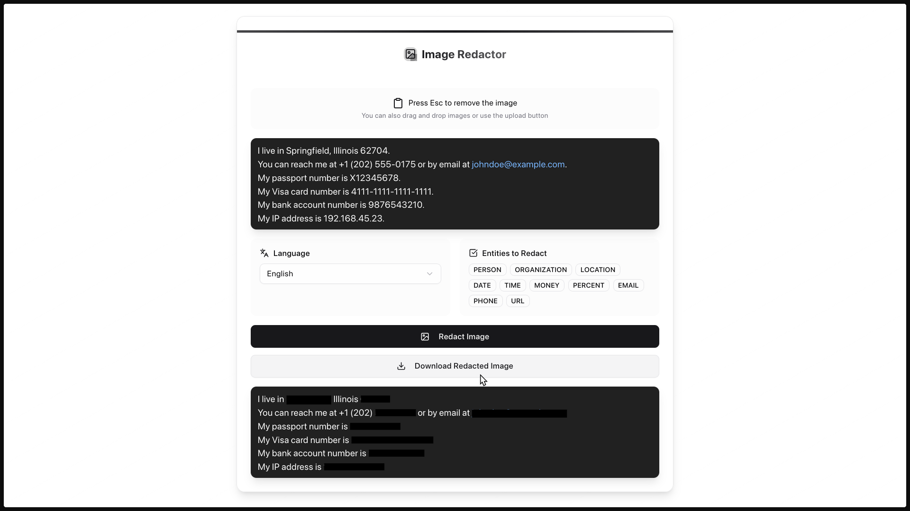
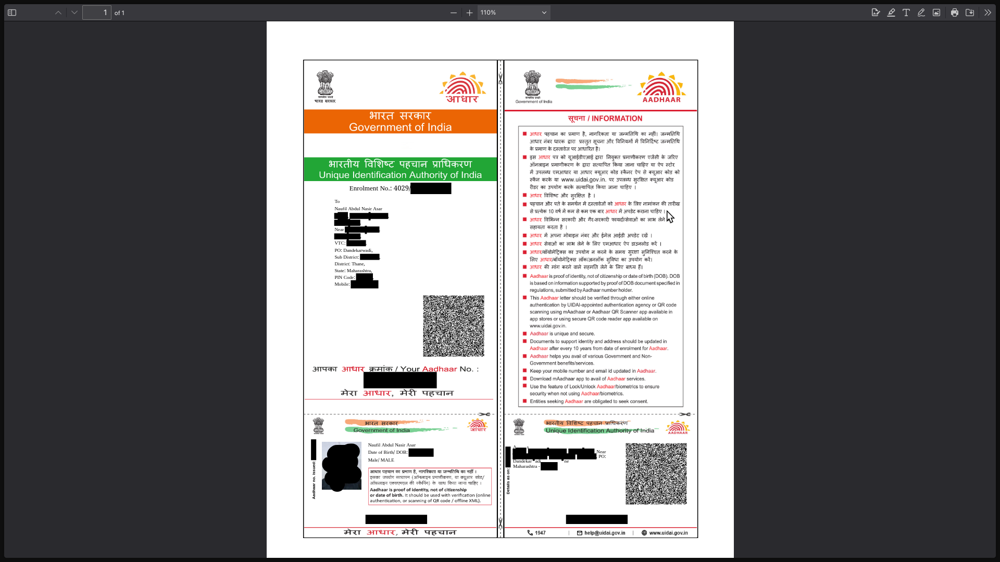
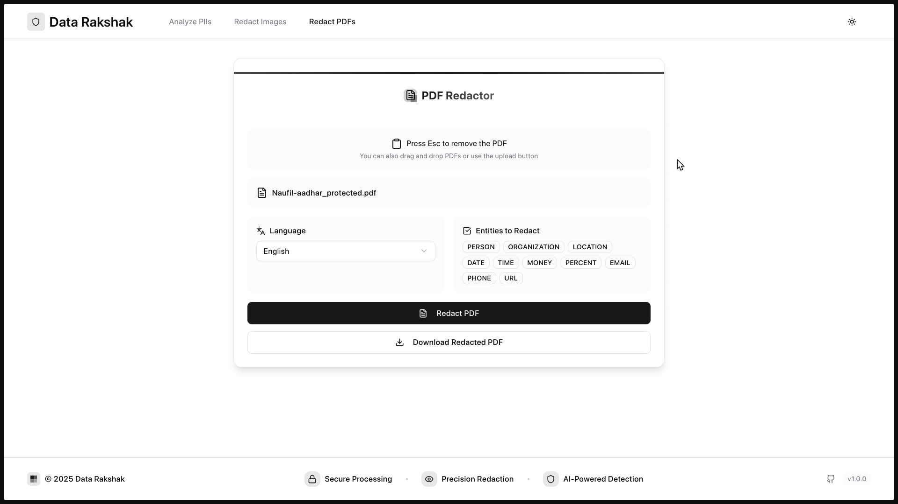

# Guardian analyzer

## Description

The Guardian analyzer is a Python-based service for detecting PII entities in text.

During analysis, it runs a set of different _PII Recognizers_,
each one in charge of detecting one or more PII entities using different mechanisms.

---

## Preview

_All screenshots below are for demonstration purposes only and contain only demo data._

| Dashboard | Text analysis feature |
|-----------|-----------------------|
|  |  |

| Image redaction | PDF redaction result |
|-----------------|----------------------|
|  |  |

| PDF redaction demo (UI) |
|-------------------------|
|  |

---

## Simple usage example

```python
from guardian_analyzer import AnalyzerEngine

# Set up the engine, loads the NLP module and other PII recognizers
analyzer = AnalyzerEngine()

# Call analyzer to get results
results = analyzer.analyze(text="My phone number is 212-555-5555",
                           entities=["PHONE_NUMBER"],
                           language='en')
print(results)

